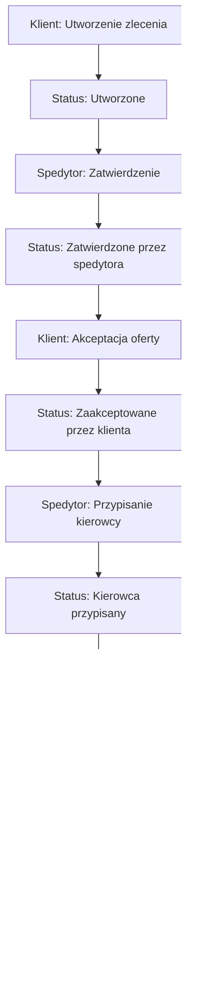

# GlobaLogix - Dokumentacja techniczna systemu
## System zarządzania zleceniami transportowymi

---

## Spis treści

1. [Wprowadzenie](#wprowadzenie)
2. [Architektura systemu](#architektura-systemu)
3. [Struktura bazy danych](#struktura-bazy-danych)
4. [API Endpoints](#api-endpoints)
5. [Frontend - struktura plików](#frontend---struktura-plików)
6. [Backend - Command/Query Handlers](#backend---commandquery-handlers)
7. [Workflow procesów biznesowych](#workflow-procesów-biznesowych)
8. [Instrukcje instalacji](#instrukcje-instalacji)
9. [Konfiguracja i uruchomienie](#konfiguracja-i-uruchomienie)
10. [Testowanie systemu](#testowanie-systemu)
11. [Rozwiązywanie problemów](#rozwiązywanie-problemów)

---

## Wprowadzenie

GlobaLogix to kompleksowy system zarządzania zleceniami transportowymi zbudowany w oparciu o nowoczesne wzorce architektoniczne CQRS (Command Query Responsibility Segregation) i Event Sourcing. System obsługuje pełny cykl życia zlecenia transportowego od momentu złożenia przez klienta do ostatecznej dostawy przez kierowcę.

### Główne funkcjonalności:
- **Zarządzanie zleceniami** - tworzenie, zatwierdzanie, śledzenie
- **System ról** - Klient, Spedytor, Kierowca
- **Śledzenie w czasie rzeczywistym** - lokalizacja, statusy
- **Generowanie dokumentów** - faktury, listy przewozowe
- **Panel kierowcy** - zarządzanie dostawami

---

## Architektura systemu

### Wzorce architektoniczne

#### CQRS (Command Query Responsibility Segregation)
System rozdziela operacje zapisu (Commands) od operacji odczytu (Queries):

```
┌─────────────┐    ┌──────────────┐    ┌─────────────┐
│   Frontend  │───▶│ CommandBus   │───▶│  Handlers   │
│             │    │              │    │             │
│             │◄───│  QueryBus    │◄───│  Handlers   │
└─────────────┘    └──────────────┘    └─────────────┘
                            │
                            ▼
                   ┌─────────────────┐
                   │   Event Store   │
                   └─────────────────┘
                            │
                            ▼
                   ┌─────────────────┐
                   │   Projections   │
                   └─────────────────┘
```

#### Event Sourcing
Zamiast przechowywania aktualnego stanu, system zapisuje sekwencję wydarzeń:

```php
// Przykład wydarzenia
class OrderSubmitted extends DomainEvent {
    public function __construct(
        public string $company,
        public string $pickup,
        public string $delivery,
        public string $cargo,
        public float $weight
    ) {}
}
```

### Struktura katalogów

```
GlobaLogix/
├── public/                 # Frontend aplikacji
│   ├── app.js             # Główna logika JavaScript
│   ├── index.html         # Strona główna
│   ├── style.css          # Stylowanie
│   ├── views/             # Widoki PHP
│   │   ├── addForm.php    # Formularz nowego zlecenia
│   │   ├── driverPanel.php # Panel kierowcy
│   │   └── orderDetails.php # Szczegóły zlecenia
│   └── index.php          # Router i konfiguracja
├── src/                   # Backend aplikacji
│   ├── Command/           # Definicje komend
│   ├── CommandHandler/    # Obsługa komend
│   ├── Query/             # Definicje zapytań
│   ├── QueryHandler/      # Obsługa zapytań
│   ├── Event/             # Wydarzenia domenowe
│   ├── Infrastructure/    # Infrastruktura (EventStore, Bazy)
│   └── Projection/        # Projekcje read-model
└── docker/                # Konfiguracja Docker
    └── mysql/
        └── init-scripts/
            └── init.sql   # Inicjalizacja bazy danych
```

---

## Struktura bazy danych

### Główne tabele

#### 1. order_list (główna tabela zleceń - read model)
```sql
CREATE TABLE `order_list` (
  `ID_order` int(11) NOT NULL AUTO_INCREMENT,
  `ID_status` int(11) NOT NULL DEFAULT 1,
  `ID_driver` int(11) NULL,
  `company` varchar(255) NOT NULL,
  `location_from` varchar(255) NOT NULL,
  `location_to` varchar(255) NOT NULL,
  `cargo` text NOT NULL,
  `weight` decimal(10,2) NOT NULL,
  `created_at` timestamp DEFAULT CURRENT_TIMESTAMP,
  `updated_at` timestamp DEFAULT CURRENT_TIMESTAMP ON UPDATE CURRENT_TIMESTAMP,
  PRIMARY KEY (`ID_order`)
);
```

#### 2. status (statusy zleceń)
```sql
CREATE TABLE `status` (
  `ID_status` int(11) NOT NULL AUTO_INCREMENT,
  `name_status` varchar(100) NOT NULL,
  PRIMARY KEY (`ID_status`)
);

-- Statusy:
-- 1: Utworzone
-- 2: Zatwierdzone przez spedytora  
-- 3: Zaakceptowane przez klienta
-- 4: W trakcie
-- 5: Pobrano ładunek
-- 6: Dostarczone
-- 7: Anulowane
```

#### 3. driver (kierowcy)
```sql
CREATE TABLE `driver` (
  `ID_driver` int(11) NOT NULL AUTO_INCREMENT,
  `name_driver` varchar(255) NOT NULL,
  PRIMARY KEY (`ID_driver`)
);
```

#### 4. events (Event Store)
```sql
CREATE TABLE `events` (
  `id` int(11) NOT NULL AUTO_INCREMENT,
  `type` varchar(255) NOT NULL,
  `payload` text NOT NULL,
  `created_at` timestamp DEFAULT CURRENT_TIMESTAMP,
  PRIMARY KEY (`id`)
);
```

#### 5. order_tracking (śledzenie lokalizacji)
```sql
CREATE TABLE `order_tracking` (
  `id` int(11) NOT NULL AUTO_INCREMENT,
  `order_id` int(11) NOT NULL,
  `latitude` decimal(10,8) NOT NULL,
  `longitude` decimal(11,8) NOT NULL,
  `updated_at` timestamp DEFAULT CURRENT_TIMESTAMP,
  PRIMARY KEY (`id`)
);
```

#### 6. order_routes (planowane trasy)
```sql
CREATE TABLE `order_routes` (
  `id` int(11) NOT NULL AUTO_INCREMENT,
  `order_id` int(11) NOT NULL,
  `route` text NOT NULL,
  `estimated_time` varchar(50) DEFAULT NULL,
  `estimated_cost` decimal(10,2) DEFAULT NULL,
  `planned_at` timestamp DEFAULT CURRENT_TIMESTAMP,
  PRIMARY KEY (`id`)
);
```

#### 7. order_documents (dokumenty)
```sql
CREATE TABLE `order_documents` (
  `id` int(11) NOT NULL AUTO_INCREMENT,
  `order_id` int(11) NOT NULL,
  `document_type` varchar(100) NOT NULL,
  `document_path` varchar(500) NOT NULL,
  `generated_at` timestamp DEFAULT CURRENT_TIMESTAMP,
  PRIMARY KEY (`id`)
);
```

---

## API Endpoints

### Commands (POST)

#### Zarządzanie zleceniami
```http
POST /api/commands/submit-order
Content-Type: application/json
{
  "company": "Firma ABC",
  "pickup": "Warszawa",
  "delivery": "Kraków", 
  "cargo": "Elektronika",
  "weight": 150.5
}
```

```http
POST /api/commands/validate-order
Content-Type: application/json
{
  "orderId": "1",
  "approved": true,
  "comments": "Zlecenie zatwierdzone"
}
```

```http
POST /api/commands/assign-driver
Content-Type: application/json
["1", "2"]  // [orderId, driverId]
```

```http
POST /api/commands/accept-offer
Content-Type: application/json
{
  "orderId": "1"
}
```

#### Zarządzanie dostawami
```http
POST /api/commands/start-delivery
Content-Type: application/json
{
  "orderId": 1,
  "driverId": 1
}
```

```http
POST /api/commands/complete-delivery
Content-Type: application/json
{
  "orderId": 1,
  "driverId": 1,
  "signature": "Jan Kowalski"
}
```

```http
POST /api/commands/update-location
Content-Type: application/json
{
  "orderId": 1,
  "driverId": 1,
  "latitude": 52.2297,
  "longitude": 21.0122
}
```

#### Dodatkowe funkcje
```http
POST /api/commands/plan-route
Content-Type: application/json
{
  "orderId": 1
}
```

```http
POST /api/commands/generate-document
Content-Type: application/json
{
  "orderId": 1,
  "documentType": "faktura"
}
```

```http
POST /api/commands/update-order-status
Content-Type: application/json
{
  "orderId": 1,
  "status": "in_progress",
  "driverId": 1
}
```

### Queries (GET)

#### Podstawowe zapytania
```http
GET /api/queries/orders
# Zwraca: Listę wszystkich zleceń z pełnymi szczegółami
```

```http
GET /api/queries/drivers
# Zwraca: Listę dostępnych kierowców
```

```http
GET /api/queries/companies?search=ABC
# Zwraca: Firmy pasujące do wyszukiwania (autocomplete)
```

#### Szczegółowe informacje
```http
GET /api/queries/tracking-info?orderId=1
# Zwraca: Informacje o śledzeniu zlecenia
{
  "ID_order": 1,
  "status": "W trakcie",
  "name_driver": "Janusz Mikke",
  "latitude": 52.2297,
  "longitude": 21.0122,
  "last_location_update": "2024-01-15 14:30:00",
  "route": "Warszawa -> Kraków",
  "estimated_time": "3:30"
}
```

```http
GET /api/queries/documents?orderId=1
# Zwraca: Listę dokumentów dla zlecenia
```

```http
GET /api/queries/order-history?orderId=1
# Zwraca: Historię wydarzeń dla zlecenia
```

---

## Frontend - struktura plików

### app.js - główny plik JavaScript

#### Główne funkcje systemu:

##### Zarządzanie zleceniami
```javascript
// Ładowanie listy zleceń
async function loadOrders()

// Szczegóły zlecenia z modalem
async function detailsOrder(order)

// Planowanie trasy
async function planRoute(orderId)

// Śledzenie zlecenia
async function trackOrder(orderId)
```

##### Panel kierowcy
```javascript
// Aktualizacja danych panelu kierowcy
async function updateDriverPanelData()

// Konfiguracja akcji dostawy
function setupDeliveryActions(order)

// Obsługa rozpoczęcia dostawy
async function handleStartDelivery(orderId)

// Obsługa zakończenia dostawy  
async function handleCompleteDelivery(orderId)
```

##### System ról i uprawnień
```javascript
// Różne funkcjonalności dla różnych ról:
// - Klient: tworzenie zleceń, akceptacja ofert
// - Spedytor: zatwierdzanie, przypisywanie kierowców
// - Kierowca: zarządzanie dostawami
```

### Widoki PHP

#### views/addForm.php
Formularz tworzenia nowego zlecenia z:
- Autocomplete dla firm
- Walidacją pól
- Responsywnym designem

#### views/driverPanel.php
Panel kierowcy zawierający:
- Statystyki osobiste
- Lista aktywnych zleceń
- Panel zarządzania dostawą
- Akcje zależne od statusu
- Formularz aktualizacji lokalizacji

#### views/orderDetails.php  
Szczegółowy widok zlecenia z:
- Pełnymi informacjami o zleceniu
- Formularzem edycji (dla spedytora)
- Przyciskami akcji zależnymi od roli
- Informacjami o trasie

---

## Backend - Command/Query Handlers

### Command Handlers

#### SubmitOrderHandler
```php
class SubmitOrderHandler {
    public function handle(SubmitOrderCommand $c): array {
        $e = new OrderSubmitted(
            $c->company, 
            $c->pickup, 
            $c->delivery, 
            $c->cargo, 
            $c->weight
        );
        EventStore::append($e);
        return ['status' => 'OrderSubmitted'];
    }
}
```

#### UpdateOrderStatusHandler
```php
class UpdateOrderStatusHandler {
    public function handle(UpdateOrderStatusCommand $command): array {
        // Walidacja uprawnień kierowcy
        // Sprawdzenie możliwych przejść statusów
        // Aktualizacja w bazie danych
        // Zwrócenie potwierdzenia
    }
}
```

#### CompleteDeliveryHandler
```php
class CompleteDeliveryHandler {
    public function handle(CompleteDeliveryCommand $cmd): array {
        $event = new DeliveryCompleted(
            $cmd->orderId,
            $cmd->driverId,
            date('Y-m-d H:i:s'),
            "Punkt docelowy",
            $cmd->signature
        );
        EventStore::append($event);
        // ...
    }
}
```

### Query Handlers

#### GetOrdersHandler
```php
class GetOrdersHandler {
    public function handle(GetOrdersQuery $q): array {
        return ReadModelRepository::fetchAll('order_list');
    }
}
```

#### GetTrackingInfoHandler
```php
class GetTrackingInfoHandler {
    public function handle(GetTrackingInfoQuery $q): array {
        // JOIN order_list + tracking + routes
        // Zwrócenie pełnych informacji o śledzeniu
    }
}
```

---

## Workflow procesów biznesowych

### Pełny cykl życia zlecenia



### Szczegółowe stany i przejścia

#### 1. Utworzone (ID=1)
- **Kto może:** Klient
- **Akcje:** Edycja szczegółów
- **Następny stan:** Zatwierdzone przez spedytora

#### 2. Zatwierdzone przez spedytora (ID=2)  
- **Kto może:** Spedytor
- **Akcje:** Przypisanie kierowcy, planowanie trasy
- **Następny stan:** Zaakceptowane przez klienta

#### 3. Zaakceptowane przez klienta (ID=3)
- **Kto może:** Kierowca
- **Akcje:** Rozpoczęcie dostawy, planowanie trasy
- **Następny stan:** W trakcie

#### 4. W trakcie (ID=4)
- **Kto może:** Kierowca  
- **Akcje:** Aktualizacja lokalizacji, zakończenie dostawy
- **Następny stan:** Pobrano ładunek lub Dostarczone

#### 5. Pobrano ładunek (ID=5)
- **Kto może:** Kierowca
- **Akcje:** Zakończenie dostawy
- **Następny stan:** Dostarczone

#### 6. Dostarczone (ID=6)
- **Stan końcowy**
- **Akcje:** Generowanie dokumentów, przeglądanie historii

---

## Instrukcje instalacji

### Wymagania systemowe

- **PHP 8.0+** z rozszerzeniami PDO, MySQL
- **MySQL 8.0+** lub MariaDB 10.5+
- **Serwer web** (Apache/Nginx) lub PHP built-in server
- **Composer** do zarządzania zależnościami PHP
- **Docker & Docker Compose** (opcjonalnie)

### Instalacja za pomocą Docker (zalecane)

#### 1. Klonowanie repozytorium
```bash
git clone <repository-url> GlobaLogix
cd GlobaLogix
```

#### 2. Uruchomienie środowiska Docker
```bash
# Uruchomienie kontenerów
docker-compose up -d

# Sprawdzenie statusu
docker-compose ps
```

#### 3. Instalacja zależności PHP
```bash
# Jeśli masz composer lokalnie
composer install

# Lub przez Docker
docker-compose exec app composer install
```

### Instalacja manualna

#### 1. Konfiguracja bazy danych
```bash
# Utwórz bazę danych
mysql -u root -p
CREATE DATABASE globalogix;
USE globalogix;

# Zaimportuj schemat
mysql -u root -p globalogix < docker/mysql/init-scripts/init.sql
```

#### 2. Konfiguracja połączenia z bazą
Edytuj plik `src/Connection.php`:
```php
class Connection {
    private static $dsn = 'mysql:host=localhost;dbname=globalogix;charset=utf8';
    private static $username = 'twoja_nazwa_uzytkownika';
    private static $password = 'twoje_haslo';
    // ...
}
```

#### 3. Instalacja zależności
```bash
composer install
```

#### 4. Uruchomienie serwera
```bash
# PHP built-in server
cd public
php -S localhost:8000

# Lub konfiguracja Apache/Nginx wskazująca na folder public/
```

---

## Konfiguracja i uruchomienie

### Zmienne środowiskowe (docker-compose.yml)

```yaml
environment:
  MYSQL_ROOT_PASSWORD: rootpassword
  MYSQL_DATABASE: globalogix
  MYSQL_USER: user
  MYSQL_PASSWORD: password
```

### Konfiguracja aplikacji

#### Database Connection (src/Connection.php)
```php
class Connection {
    private static $dsn = 'mysql:host=mysql;dbname=globalogix;charset=utf8';
    private static $username = 'user';
    private static $password = 'password';
    
    public static function getInstance(): PDO {
        if (self::$pdo === null) {
            self::$pdo = new PDO(self::$dsn, self::$username, self::$password, [
                PDO::ATTR_ERRMODE => PDO::ERRMODE_EXCEPTION,
                PDO::ATTR_DEFAULT_FETCH_MODE => PDO::FETCH_ASSOC,
            ]);
        }
        return self::$pdo;
    }
}
```

### Pierwsze uruchomienie

#### 1. Dostęp do aplikacji
Otwórz przeglądarkę i przejdź do:
- **Docker:** http://localhost:8080
- **Manual:** http://localhost:8000

#### 2. Testowe dane
Aplikacja zawiera podstawowe dane testowe:

**Kierowcy:**
- Janusz Mikke (ID: 1)
- Anna Kowalska (ID: 2)  
- Piotr Nowak (ID: 3)

**Firmy (dla autocomplete):**
- Firma ABC
- Transport XYZ
- Logistyka 123

#### 3. Zmiana roli użytkownika
W prawym górnym rogu znajduje się dropdown do zmiany roli:
- Klient
- Spedytor  
- Kierowca

---

## Testowanie systemu

### Scenariusz testowy - kompletny workflow

#### 1. Jako Klient - utworzenie zlecenia
```javascript
// Przejdź do roli "Klient"
// Kliknij "Nowe zlecenie"
// Wypełnij formularz:
{
  "company": "Test Transport",
  "pickup": "Warszawa, ul. Testowa 1", 
  "delivery": "Kraków, ul. Docelowa 5",
  "cargo": "Sprzęt elektroniczny",
  "weight": "25.5"
}
// Kliknij "Dodaj zlecenie"
```

#### 2. Jako Spedytor - zatwierdzenie zlecenia
```javascript
// Przełącz na rolę "Spedytor"
// Znajdź zlecenie o statusie "Utworzone"
// Kliknij na zlecenie aby otworzyć szczegóły
// Wybierz kierowcę z dropdown
// Kliknij "Zatwierdź zlecenie"
```

#### 3. Jako Klient - akceptacja oferty
```javascript
// Przełącz na rolę "Klient"
// Znajdź zlecenie o statusie "Zatwierdzone przez spedytora"
// Kliknij na zlecenie
// Kliknij "Akceptuj ofertę"
```

#### 4. Jako Kierowca - zarządzanie dostawą
```javascript
// Przełącz na rolę "Kierowca"
// Kliknij "Panel kierowcy"
// Wybierz zlecenie z dropdown "Aktywne zlecenie"
// Kliknij "Rozpocznij dostawę"
// Aktualizuj lokalizację
// Kliknij "Zakończ dostawę"
// Wprowadź podpis odbiorcy
```

### Testowanie API za pomocą curl

#### Utworzenie zlecenia
```bash
curl -X POST http://localhost:8080/api/commands/submit-order \
  -H "Content-Type: application/json" \
  -d '{
    "company": "Test API",
    "pickup": "Punkt A",
    "delivery": "Punkt B",
    "cargo": "Test cargo", 
    "weight": 10.5
  }'
```

#### Pobranie listy zleceń
```bash
curl -X GET http://localhost:8080/api/queries/orders
```

#### Śledzenie zlecenia
```bash
curl -X GET "http://localhost:8080/api/queries/tracking-info?orderId=1"
```

### Walidacja funkcjonalności

#### Panel kierowcy - automatyczna walidacja
Aplikacja zawiera wbudowaną funkcję `validateOrderActions()` która:
- Sprawdza poprawność wyświetlania akcji dla różnych statusów
- Testuje przejścia między statusami
- Waliduje UI w panelu kierowcy

Wywołanie testów:
```javascript
// W konsoli przeglądarki (panel kierowcy)
validateOrderActions(2); // Test zlecenia #2
```

---

## Rozwiązywanie problemów

### Najczęstsze problemy

#### 1. Błąd połączenia z bazą danych
```
Error: SQLSTATE[HY000] [1045] Access denied for user
```

**Rozwiązanie:**
- Sprawdź konfigurację w `src/Connection.php`
- Upewnij się że MySQL działa
- Sprawdź czy baza danych została utworzona

#### 2. Błąd "Class not found"
```
Fatal error: Class 'App\Command\SubmitOrderCommand' not found
```

**Rozwiązanie:**
```bash
# Zainstaluj/zaktualizuj autoloader
composer dump-autoload
```

#### 3. JavaScript nie działa
```
Uncaught ReferenceError: api is not defined
```

**Rozwiązanie:**
- Sprawdź czy `app.js` jest poprawnie załadowany
- Otwórz konsole przeglądarki dla szczegółów błędu
- Upewnij się że serwer obsługuje pliki statyczne

#### 4. Modal się nie otwiera
**Rozwiązanie:**
- Sprawdź czy Bootstrap jest załadowany
- Sprawdź czy ścieżki do plików widoków są poprawne
- Sprawdź czy funkcja `showModal()` jest dostępna

#### 5. Panel kierowcy nie działa
**Rozwiązanie:**
- Sprawdź czy jesteś w roli "Kierowca"
- Sprawdź czy funkcja `updateDriverPanelData()` została wywołana
- Sprawdź w konsoli czy są błędy JavaScript

### Debugging

#### Włączenie trybu debug w PHP
```php
// W index.php dodaj na początku:
error_reporting(E_ALL);
ini_set('display_errors', 1);
```

#### Debug w JavaScript
```javascript
// Włącz verbose logging
console.log('Debug info:', data);

// Sprawdź dostępne funkcje globalne
console.log('Available functions:', Object.keys(window));
```

#### Monitoring bazy danych
```sql
-- Sprawdź ostatnie wydarzenia
SELECT * FROM events ORDER BY created_at DESC LIMIT 10;

-- Sprawdź statusy zleceń
SELECT o.ID_order, o.company, s.name_status, o.created_at 
FROM order_list o 
JOIN status s ON o.ID_status = s.ID_status 
ORDER BY o.created_at DESC;
```

### Logi systemowe

#### Logi Docker
```bash
# Logi aplikacji
docker-compose logs app

# Logi bazy danych  
docker-compose logs mysql

# Logi w czasie rzeczywistym
docker-compose logs -f
```

#### Logi PHP (jeśli nie używasz Docker)
- **Linux:** `/var/log/apache2/error.log` lub `/var/log/nginx/error.log`
- **Windows:** sprawdź konfigurację serwera

### Przywracanie systemu

#### Reset bazy danych
```bash
# Docker
docker-compose down
docker-compose up -d

# Manual
mysql -u root -p globalogix < docker/mysql/init-scripts/init.sql
```

#### Czyszczenie cache
```bash
# PHP OPcache (jeśli włączony)
opcache_reset();

# Browser cache
# Ctrl+F5 lub Ctrl+Shift+R
```

---

## Dodatkowe informacje

### Kontakt i wsparcie
W przypadku problemów technicznych, sprawdź:
1. **Logi systemu** - pierwsza linia debugowania
2. **Konsola przeglądarki** - błędy JavaScript
3. **Network tab** - problemy z API
4. **Dokumentacja kodu** - komentarze w kodzie źródłowym

### Rozwijanie systemu
System został zaprojektowany z myślą o łatwej rozbudowie:
- **Nowe komendy:** dodaj klasę w `src/Command/` i handler w `src/CommandHandler/`
- **Nowe zapytania:** dodaj klasę w `src/Query/` i handler w `src/QueryHandler/`
- **Nowe wydarzenia:** dodaj klasę w `src/Event/` i projekcję w `src/Projection/`
- **Nowe widoki:** dodaj plik PHP w `public/views/`

### Bezpieczeństwo
Aktualne środowisko jest skonfigurowane do celów developmentu. W środowisku produkcyjnym należy:
- Skonfigurować HTTPS
- Dodać system autoryzacji i uwierzytelniania
- Ustawić odpowiednie uprawnienia do plików
- Skonfigurować firewall i monitoring

---

*Dokumentacja wygenerowana dla GlobaLogix v1.0*
*Ostatnia aktualizacja: 2024-01-15*
